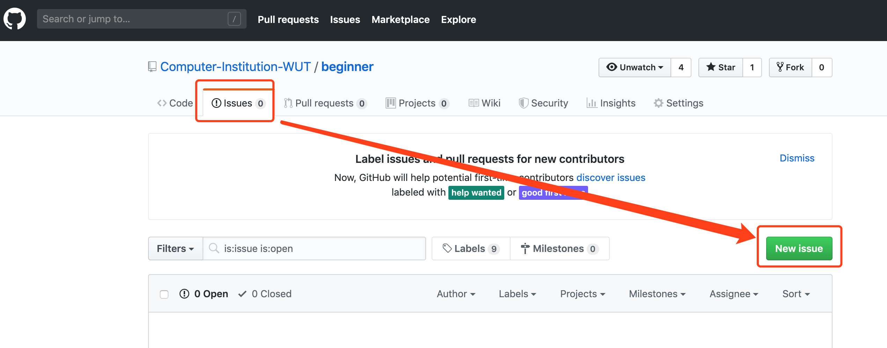
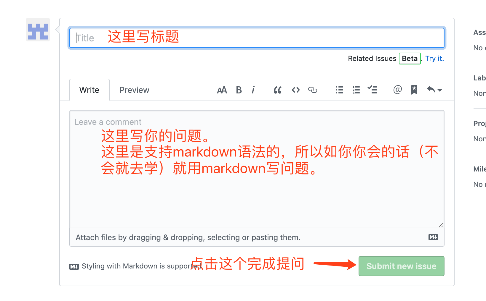

# Welcome

欢迎来到计算机协会的同学们！

# 最开始想说的话

> 路漫漫其修远兮，吾将上下而求索。

编程，或者说计算机学习，需要坚强的信念和刨根问底的精神，这些精神将为你照亮前方的路。

> 学会问问题

向他人请教前，请自己问自己以下几个问题，以免被他人diss
- 自己Google了么？
- 自己百度了么？
- 自己stackoverflow了么？
- 自己有没有进行过分析？是否提问的时候能陈述清楚自己的问题，及自己已经进行过的尝试，以及因什么原因卡壳了？
- 如果前面的问题你的回答都是肯定的，那么你可以提问了。

> 我在这里怎么提问

每个仓库都有一个 [Issues](https://github.com/Computer-Institution-WUT/beginner/issues) 页面，如下

https://github.com/Computer-Institution-WUT/beginner/issues

点击 `New Issue` 就可以提问了。

> 请注意

提问前，在 `Issues` 里面搜索下，看看别人是否提过这个问题。

如果有人的回答解决了你的疑问，请点个赞！

感谢你的支持！

# 编程第一步：源代码管理/版本管理

[了解Git](./classes/1.1_git.md)

更新记录：
- 2019-09-24 创建Git入门

# C语言入门 【仅仅只是入门】

[从实践到熟练](./begin_with_c)

更新记录：
- 2019-09-27 创建C语言入门

# 关于贡献

- 任何同学，不论是否是计算机协会的正式会员，均可为项目作出贡献。
- 作出贡献的方式为提交 [`Pull Request(PR)`](https://help.github.com/cn/articles/about-pull-requests)
  - `Computer Institution of Wuhan University of Technology` 的成员贡献者可直接开分支提交贡献。
  - 其它贡献者可 `fork` 后发起 `Pull Request(PR)`
- 合并 `PR` 的方式
  - Github 组织 `Computer Institution of Wuhan University of Technology` 的成员在确保没有冲突的情况下，可以直接 `merge` 自己的 `Pull Request(PR)`。
  - 其它贡献者的 PR 由组织成员负责审核，决定是否 `merge`。
