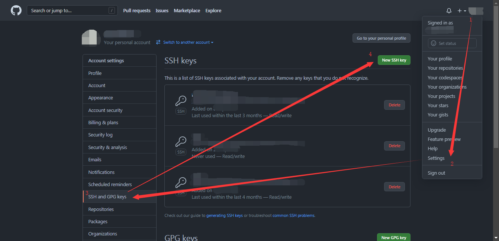

# 初学者的第一个git实践

## the common Why?

使用git前，需要先确定一个问题，我为什么要使用git？或者说我要使用git来达到什么目的？

如果还没有一个明确的答案，那么可以先看看已经有的例子：

1. 使用git管理工件版本

这里的工件不局限于代码、文本等工件，几乎所有的文件都可以使用git来记录、回溯版本。  
只不过只有纯文本文件可以使用`git diff`来定位具体改动点。

  > git开发的初衷是用于管理代码版本。在软件开发的早期，一个叫做svn的版本管理工具大行其道，但是由于价格昂贵且存在一定的代码管理场景不符合的问题（说白了就是又要钱又不好用），Linux内核的创作者Linus大佬看不下去了，于是自己闭关了一段时间，复出的时候带来了一款被迫让svn开源的版本管理软件——git。后来，即使是svn被迫开源了，也没法阻止它落寞的趋势，毕竟git比svn太好用了。

  > git可以对每个文件中的每一行都保存一个“提交记录”，并且附带有作者的昵称、邮箱，代码维护人员在遇到问题时可以迅速地联系到代码的原作者。  
  > git可以在代码仓库中配置多条不同用途的分支，每个平行分支之间互不干扰，且提供分支合并功能，对代码的协同开发提供了巨大便利。  
  > ...

  > 以上的用法也可以用于非代码类文件的版本管理。

2. 使用git做云端备份

  > git提供了一个只能用于登录、操作仓库、退出的`git-shell`，使其可以运行在基于ssh的服务态。在git的服务端和客户端之间可以完整同步仓库的状态，包括仓库中的文件的提交信息、修改、创建时间等。
  > 基于这一特性，许多人使用git作为文件云端备份的工具。如果搭配例如github、gitee这样的公共且免费的git服务端平台，则可以得到一个不限速的、有历史版本管理的网盘服务。
  > > 此处说的不限速需要有一定的网络环境，至少平台测不会主动限速。

还有更多git的使用场景，但是无外乎都是基于git原有功能的基础上，延伸出来的骚操作。如果你确切有以上的需求，或类似于以上的需求，那么学习git确实是十分有用的。

由于大多数同学一开始使用git都是克隆github上的代码到本地进行参考编程，所以本次例程也是基于这样的场景进行。

## git与github

> eg.
> 我曾经问过一些同学：“git会吗？(:dog:)”  
> 答曰：“那网站都是英文，我都是把代码下下来直接抄的！:-1:”

经过一番对话，我感觉他可能是把`git==github`了，而且不少人与他一样。

首先呢，要明确一点，git是一款开源的版本管理工具，可以通过一定的办法使其工作在服务端或客户端状态，服务端状态可以提供多个客户端之间的同步服务。

而github与gitlab、gitee一样，是一个包含了git服务端功能的在线代码管理平台，大家可以在上面分享和交流关于开源代码的开发经验，通常gitlab一般是公司部署在内网供内部代码管理使用的。

明确了`git!=github`之后，之后的学习路程就会减少很多疑惑的地方。

## Let's start

### 安装git

git是一款软件，要学习它，当然是要先在自己的机器上安装一份git的拷贝，实际操作一下才可以真正明白其可以产生的作用，毕竟“纸上得来终觉浅，绝知此事要躬行”。

这里安装git需要区别大家使用的计算机的平台，也就是操作系统。

- windows 平台

  大家多数都是使用windows系统作为日常学习、工作、娱乐的操作系统，所以这个就放在最前面。

  使用windows平台的同学需要去下载一个git的安装包，然后通过安装包来将git安装到自己的电脑上。

  这里列举两个git的官方发布平台（在其中一个下载就可以了），如果大家有信得过的镜像分发，那么也可以从镜像处下载：  
  [git-scm windows download](https://git-scm.com/download/win)  
  [git for windows](https://gitforwindows.org/)

  下载下来后按照默认选项一路下一步即可（不会被绑定安装流氓软件的:rofl:）。

  安装完成后，如果鼠标在桌面上右键，如果出现了“Git Bash Here”和“Git GUI Here”两个选项，则说明安装成功了。

- Linux/unix

  根据自己使用的系统或者包管理框架选择特定的命令来安装即可。不过都用上linux了，不至于连git都没装吧 :rofl:。如果在这里没有列举出来的系统，就到网上查一下具体的系统怎么安装git，然后按照教程来安装吧。

  ```bash
  #Debian/Ubuntu
  apt-get install git
  # CentOS / Fedora
  yum install git #(up to Fedora 21)
  dnf install git #(Fedora 22 and later)
  # Gentoo
  emerge --ask --verbose dev-vcs/git
  # Arch Linux
  pacman -S git
  ```

  在安装完成后，在shell中执行`git`指令，如果有所输出，则说明安装成功了。

- MacOS

  对于使用MacOS的同学，这里建议使用`Homebrew`包管理框架来安装git。如果还没有安装或使用过`brew`，则推荐先到[The Missing Package Manager for macOS -- Homebrew](https://brew.sh/)学习使用brew。

  ```bash
  brew install git
  ```

  在安装完成后，在shell中执行`git`指令，如果有所输出，则说明安装成功了。

#### 申请github账号 & 配置git客户端

由于本教程是基于git与github之间的教程，所以需要先注册一个github账号，然后再将github上的账号信息配置到git客户端中，以确保github可以识别到我们的git客户端。

1. 先到[github注册地址](https://github.com/signup)注册一个github账号，邮箱可以使用自己的任意邮箱进行注册。注册好后，就可以拿到用户名和邮箱了，先记下，后面需要用。

2. 配置git客户端。在任意位置运行Git Bash，然后在窗口中输入下面两条命令，输入时务必将WUTCOM换成第1步中记下的用户名，WUTCOM@wutcom.com换成自己注册时的邮箱：

    ```bash
    git config --global user.name WUTCOM    # WUTCOM 换成自己的用户名
    git config --global user.email WUTCOM@wutcom.com    # WUTCOM@wutcom.com 换成自己在github留下的邮箱
    ```

    经过以上1、2两步，github就可以在使用`HTTPS`协议`clone`仓库时识别我们的身份了。接下来我们配置使用`SSH`协议`clone`时所需要的身份识别因素。（在下一节会介绍什么是`clone`，这一节先把必要的身份识别需要的参数给配置好）

3. 在命令行中使用下面的命令生成一个ssh协议默认使用的rsa公私钥对（`ssh-key`），并将公钥交给github用于身份识别：

    鉴于有的同学之前可能生成过ssh-key，所以先检查一下，执行下面的命令：

    ```bash
    cat ~/.ssh/id_rsa.pub
    # if the key exist. 如果ssh-key存在，则会打印类似下面的内容：
    ssh-rsa xxxAxxxx[这中间是打码]xxxx87Txxx== xxx@xxx.com
    # if the key not exist. 如果ssh-key不存在，则会打印下面的内容：
    cat: '/c/Users/sangfor/.ssh/id_rsa.pub': No such file or directory
    ```

    如果上一步中检查时ssh-key是已经存在的，那么就可以跳过下面一步，直接将打印的内容提交到github上就可以了。没有ssh-key的话，则继续下面这一步，创建一个ssh-key。要注意的是，引号内的邮箱号换成自己的邮箱，并且半角引号要保留。

    ```bash
    ssh-keygen -t rsa -C "WUTCOM@wutcom.com"
    # 务必将WUTCOM@wutcom.com换成自己的邮箱或者其他自己认识的标识
    # 注意，务必要保留两侧的半角双引号
    # 这一步无脑回车一直到结束就可以了
    ```

    经过上一步，ssh-key就生成成功了，这时候取出ssh-key的内容（和第一步检查时一样）：
    ```bash
    cat ~/.ssh/id_rsa.pub
    ```

    将打印出来的`ssh-rsa`开头到邮箱结尾的内容复制出来，待会需要用到。  
    这时候回到Github的网页，从 右上角头像->`Settings`->左侧的`SSH and GPG keys`->`SSH keys`->`New SSH key`进入添加ssh-key的页面，如下图：
    
    

    在title处填写一个自己给这个key定的别称（因为通常会有多个key，所以取别称可以方便日后管理这些key），在key处填写刚刚复制出来的ssh-key，填写好后点击`add SSH key`，页面提示成功后，就已经将ssh-key注册到github上了，此时再去通过`SSH`协议`clone`github上的仓库时，github就可以通过我们连接中附带的私钥信息与数据库中的公钥比对而确认客户端的身份了。

4. （可选步骤）由于我们所在的网络环境比较特殊，所以有条件的同学可以给git配置一个网络代理，使得git客户端与服务端之间的数据交互更顺畅。

    通过以下步骤给git配置在使用https协议时的代理，此处的`scheme://domain_or_ip:port`要换成自己的代理协议+地址+端口。
    ```bash
    git config --global http.proxy scheme://domain_or_ip:port
    ```

    编辑`C:\Users\用户名\.ssh\config`文件（若此文件不存在，则添加一个，linux和macOS中的文件为`~/.ssh/config`），添加以下内容，给git配置在使用ssh协议时的代理，此处的`domain_or_ip:port`要换成自己的代理地址+端口，且根据代理的协议选择更换`-H`或者`-S`。给ssh协议配置代理的方式有很多种，若此种方式不成功，请自行查找资料完成代理配置（若实在无法配置成功，不适用代理连接也是可以的）。
    ```conf
    Host github.com
      ProxyCommand connect -H domain_or_ip:port %h %p # 此处的 -H 表示代理协议为 http，改为-S则使用socks协议，linux/macOS系统则将词条命令更换为ProxyCommand nc -v -x domain_or_ip:port %h %p
      HostName %h
      Port 22
      User git
      IdentityFile  ~/.ssh/id_rsa 
      IdentitiesOnly yes
    ```

### git clone & download

从现在起，我们进入一个苦于作业不会写想要去github上抄作业的大一本科生的角色。

经过学长推荐，github上有个仓库有他想要的东西，并甩给他一个链接：（这里我们就用我们这个教程的链接做例子）

> https://github.com/Computer-Institution-WUT/beginner

打开这个链接，我们可以看到以下网页：


从整个页面唯一一个绿色按钮上我们看到了有下载提示意味的图标，这个应该就是可以下载代码的地方了。

点开之后，我们从弹框结构上，看到了三个选项：


- clone
- Open with Github Desktop
- Download ZIP

这里先说说第二个`Open with Github Desktop`，这个选项顾名思义就是使用github自己的桌面客户端打开这个仓库。本教程不建议使用GUI软件学习git，但是感兴趣的同学也可以从这里进去看看：[GitHub Desktop](https://desktop.github.com/)

接着介绍一下`clone`和`download`的区别。

这里需要介绍一个基础的概念。git文档中对于git仓库的拷贝、下载都统称为“克隆”，因为git仓库不仅仅是包含了我们需要的最基础的代码文件，还包含了这个git仓库从头到尾所有的演进历史、分支、标记等，这些内容都存放在一个隐藏文件夹`.git`中，我们无需关心这个文件夹，全权交给git命令来操作即可。

就如同这里的两种选项，`clone`操作可以将仓库的所有东西原封不动、一模一样地生成一份新的拷贝；而`download`，则只是下载主线分支上最新的一份拷贝，且不包含git仓库附带的属性（提交记录、分支、标记）。

由于我们后续还需要在这个git仓库上继续学习其他的git技巧，所以我们需要使用`clone`这一特性，将仓库`clone`下来。

这时，我们又遇到了一个选择题，那就是我们在Clone下又看到了三个不同的选项：

- HTTPS
- SSH
- Github Cli

由于之前我们提到过`git!=github`，而我们在这里通过git自有的clone指令去克隆仓库却看到了Github Cli这种带有github字样的选项，就可以马上知道，这和`Github Desktop`一样，是github自己开发的工具了，所以我们这里不用它（不过感兴趣的同学可以前往[Github Cli](https://cli.github.com/)看看）。

排除了Github Cli，我们还剩下两个选项：`HTTPS`、`SSH`。  
HTTPS大家一定不陌生，大家在上网、浏览网页时，大多数时候都是HTTPS这个协议在保护着大家的信息安全（没错，大多数APP和服务端之间的数据交互也是使用HTTPS协议进行的），是一种用于安全传输数据的协议。  
而SSH是`Secure Shell`协议的缩写，是一种在不安全的网络下提供安全传输的协议，通常用于Linux、Unix用户远程登录服务器执行指令或传输文件（Windows 10 1803中也集成了OpenSSH工具，可以提供完整的SSH支持）。

经过介绍我们可以知道，`HTTPS`和`SSH`都是提供安全数据传输的协议，我们在这里选择哪一个则决定我们通过什么协议来克隆仓库。

> 通常情况下，我们无论是选择HTTPS还是SSH都是没有太大关系的，这两个协议都可以提供充足的安全加密基础。而只有在当前网络不正常时，例如受制于上网行为管理等上游网络环境的影响，SSH协议被封锁了，这时候我们就只能选择HTTPS协议来克隆仓库了，反之亦然。  
> 当然，随着我们懂得的知识越来越多，自然而然地也会有更加明确和偏向的喜好选择。

由于经过上一节本地端和服务端的信息同步，git服务端（也就是github）已经可以识别我们手中的git客户端发起的请求，而不会认为是一个陌生的链接从而直接切断链接。

我们进入一个文件夹，点击鼠标右键，点击`Git Bash Here`，在当前路径运行一个git的命令窗口。


```bash
# 使用SSH协议克隆
git clone git@github.com:Computer-Institution-WUT/beginner.git

# 使用HTTPS协议克隆
git clone https://github.com/Computer-Institution-WUT/beginner.git
# 首次使用HTTPS协议下载需要输入账号密码
```

以上指令我们按需执行其中一条即可，如果某条执行不成功，则执行另一条即可。

在执行指令完成后，且文件夹没有消失，则说明克隆仓库完成了。


我这里由于已经不是第一次克隆仓库了，所以没有提醒我输入密码，如果大家是首次从github上克隆仓库，那么输入密码的环节是肯定会有的。如果输入密码时命令窗口中没有变化，不要惊慌，是因为输入密码时密码使用了不“回显”的输入方式，以确保密码的安全性，避免他人通过肉眼观察而猜测密码位数。

---

未完待续。

- [x] git & github 
- [x] install git & config it
- [x] clone & download
- [ ] pull & fetch
- [ ] add & commit
- [ ] push