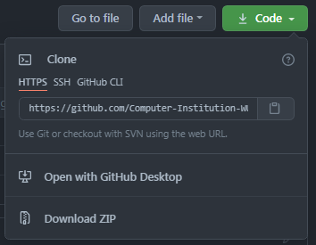

# 初学者的第一个git实践

## the common Why?

使用git前，需要先确定一个问题，我为什么要使用git？或者说我要使用git来达到什么目的？

如果还没有一个明确的答案，那么可以先看看已经有的例子：

1. 使用git管理工件版本

这里的工件不局限于代码、文本等工件，几乎所有的文件都可以使用git来记录、回溯版本。  
只不过只有纯文本文件可以使用`git diff`来定位具体改动点。

  > git开发的初衷是用于管理代码版本。在软件开发的早期，一个叫做svn的版本管理工具大行其道，但是由于价格昂贵且存在一定的代码管理场景不符合的问题（说白了就是又要钱又不好用），Linux内核的创作者Linus大佬看不下去了，于是自己闭关了一段时间，复出的时候带来了一款被迫让svn开源的版本管理软件——git。后来，即使是svn被迫开源了，也没法阻止它落寞的趋势，毕竟git比svn太好用了。

  > git可以对每个文件中的每一行都保存一个“提交记录”，并且附带有作者的昵称、邮箱，代码维护人员在遇到问题时可以迅速地联系到代码的原作者。  
  > git可以在代码仓库中配置多条不同用途的分支，每个平行分支之间互不干扰，且提供分支合并功能，对代码的协同开发提供了巨大便利。  
  > ...

  > 以上的用法也可以用于非代码类文件的版本管理。

2. 使用git做云端备份

  > git提供了一个只能用于登录、操作仓库、退出的`git-shell`，使其可以运行在基于ssh的服务态。在git的服务端和客户端之间可以完整同步仓库的状态，包括仓库中的文件的提交信息、修改、创建时间等。
  > 基于这一特性，许多人使用git作为文件云端备份的工具。如果搭配例如github、gitee这样的公共且免费的git服务端平台，则可以得到一个不限速的、有历史版本管理的网盘服务。

还有更多git的使用场景，但是无外乎都是基于git原有功能的基础上，延伸出来的骚操作。如果你确切有以上的需求，或类似于以上的需求，那么学习git确实是十分有用的。

由于大多数同学一开始使用git都是克隆github上的代码到本地进行参考编程，所以本次例程也是基于这样的场景进行。

## git与github

> eg.
> 我曾经问过一些同学：“git会吗？(:dog:)”  
> 答曰：“那网站都是英文，我都是把代码下下来直接抄的！:-1:”

经过一番对话，我感觉他可能是把git==github了，而且不少人与他一样。

首先呢，要明确一点，git是一款开源的版本管理工具，可以通过一定的办法使其工作在服务端或客户端状态，客户端状态可以提供多个客户端之间的同步服务。

而github与gitlab、gitee一样，是一个包含了git服务端功能的在线开源代码管理平台，大家可以在上面分享和交流关于开源代码的开发经验。

明确了git != github之后，之后的学习路程就会减少很多疑惑的地方。

## Let's start

从现在起，我们进入一个苦于作业不会写想要去github上抄作业的大一本科生的角色。

经过学长推荐，github上有个仓库有他想要的东西，并甩给他一个链接：（这里我们就用我们这个教程的链接做例子）

> https://github.com/Computer-Institution-WUT/beginner

打开这个链接，我们可以看到以下网页：

从整个页面唯一一个绿色按钮上我们看到了有下载提示意味的图标，点看一看，弹框中标题竟然显示的是`Clone`，说好的“下载”或者“Download”呢？

这里就需要介绍一个基础的概念。对于git仓库的拷贝、下载都统称为克隆，因为git仓库不仅仅是包含了我们需要的最基础的代码文件，还包含了这个git仓库从头到尾所有的演进历史、分支、标记等，这些内容都存放在一个隐藏文件夹`.git`中，我们无需关心这个文件夹，全权交给git命令来操作即可。

这时，我们又遇到了一个选择题，那就是我们在Clone下又看到了三个不同的选项：

分别是HTTPS、SSH、GitHub Cli这三个。

---

未完待续。